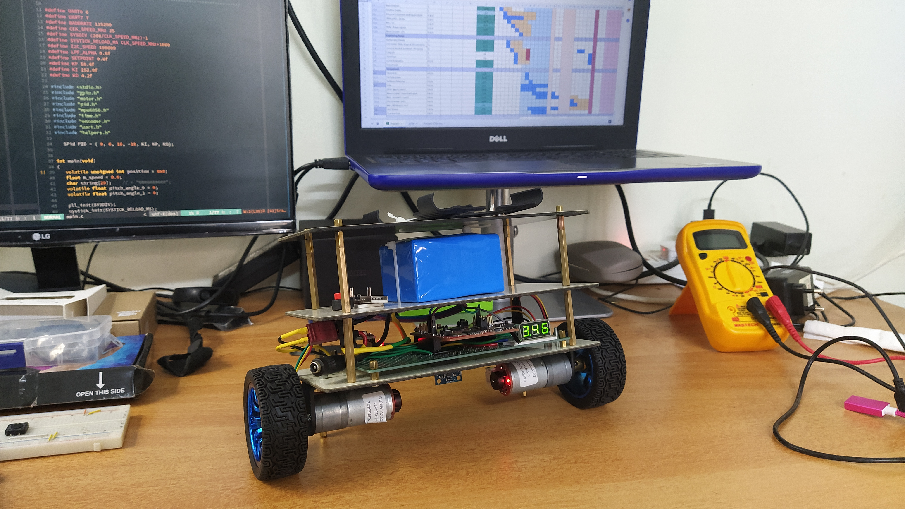
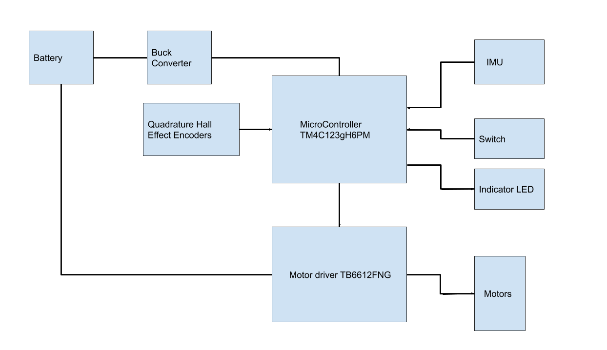
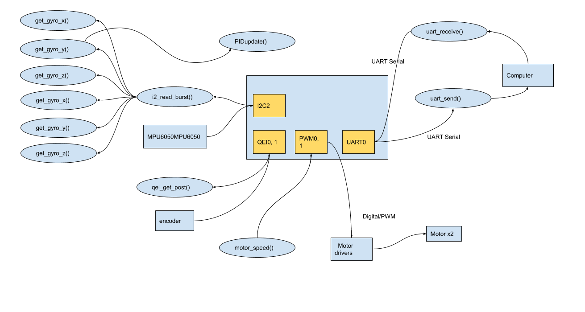
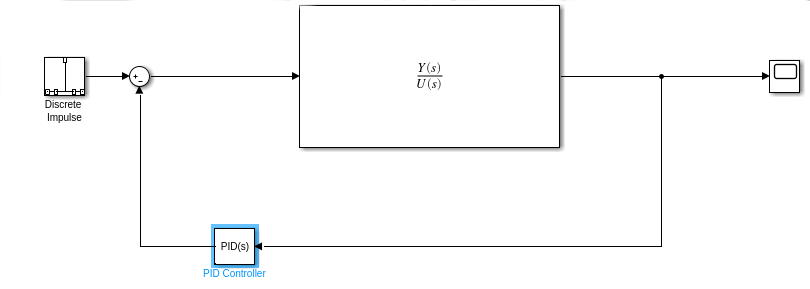
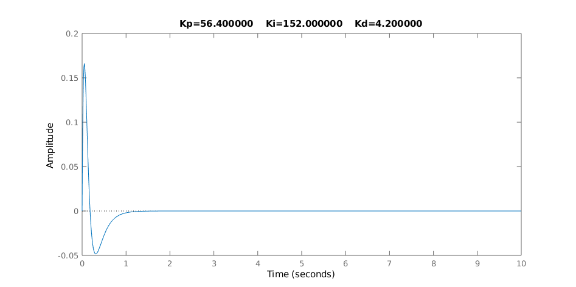
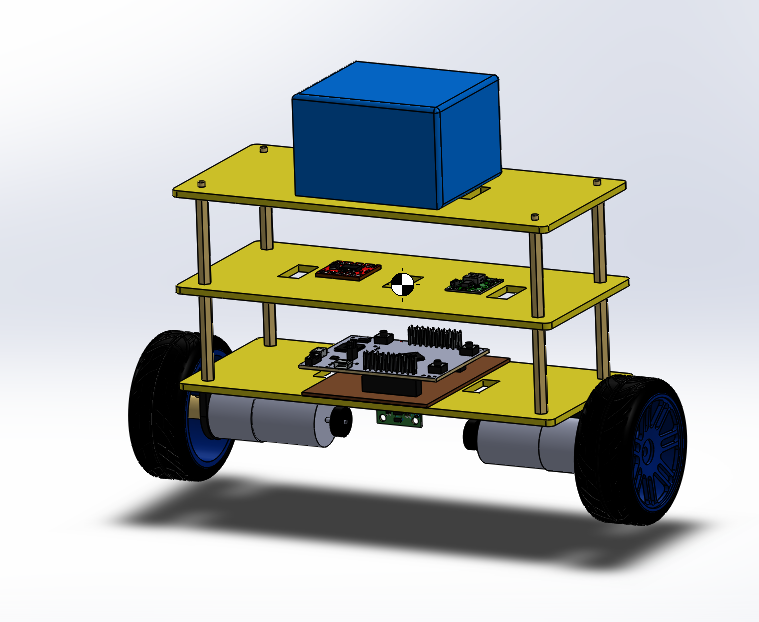
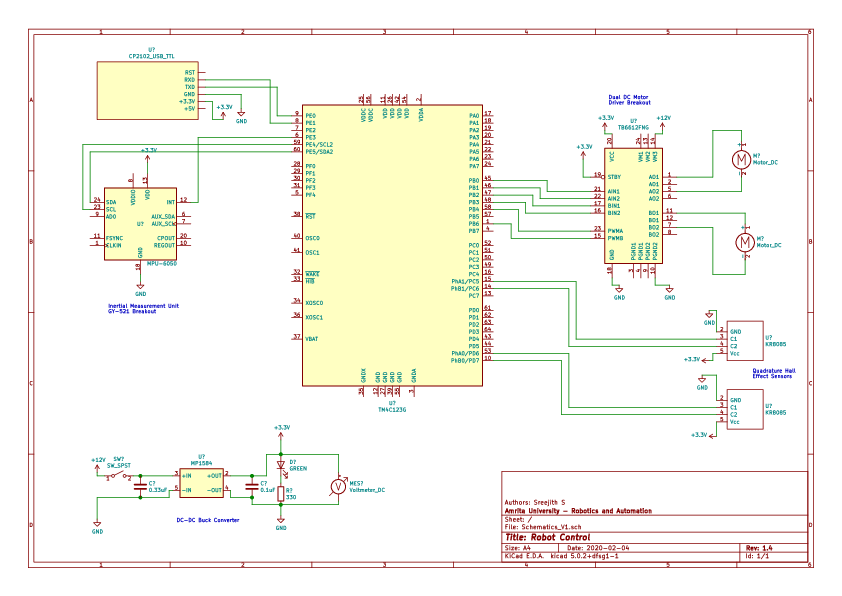
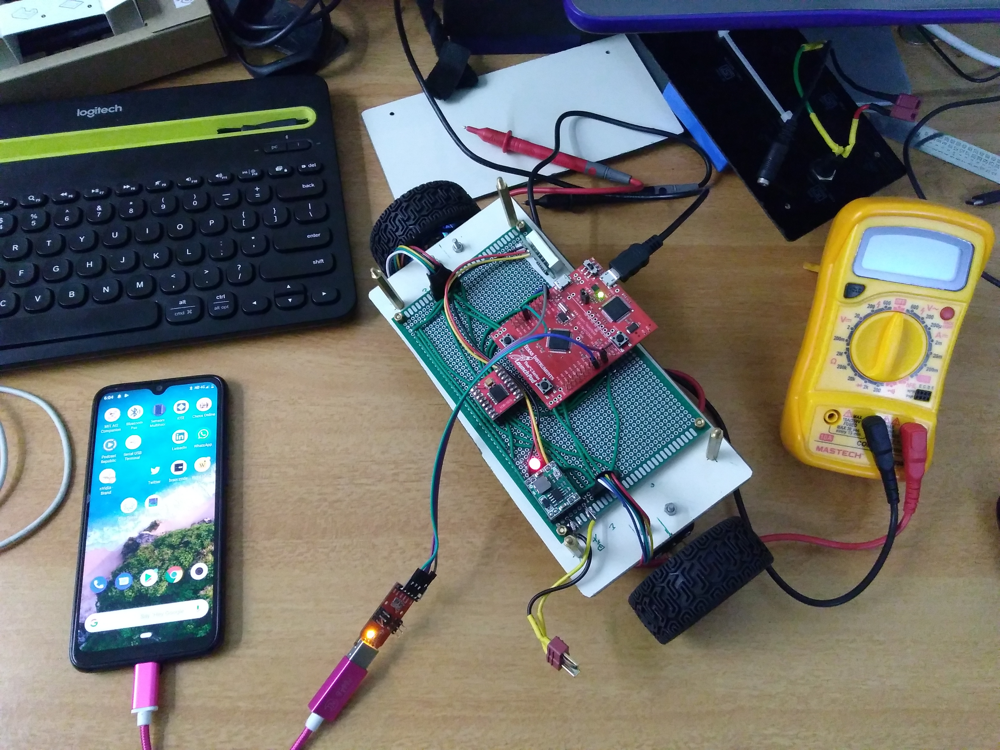
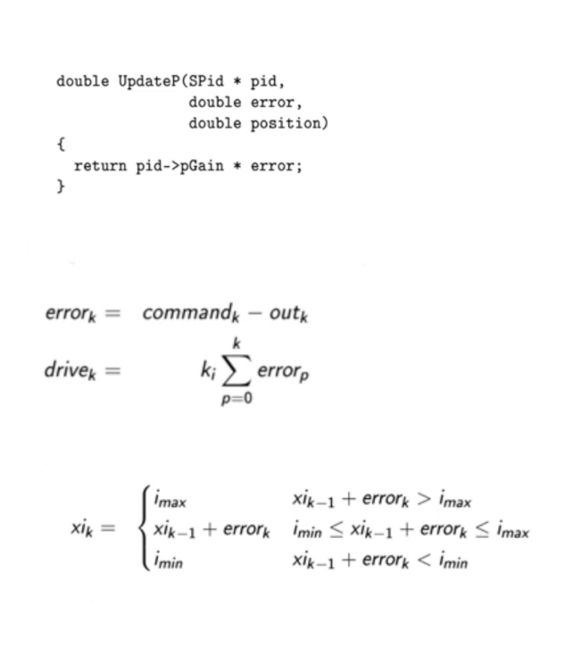

<h1>Self Balancing Robot</h1>

A Twin Wheel Inverted Pendulum Self Balancing Robot designed as part of ESD601 final project.



<h2>Problem Statement</h2>


A balancing robot is a common demonstration of controls in a dynamic system. Due to the inherent instability of the equilibrium point, appropriate controllability and observability measures must be undertaken to stabilize the system about the desired equilibrium point.

In this project we design and build a self balancing PID controlled robot using TIVA C  Series Launchpad Evaluation Kit.

***<p style="text-align: center;"> Platform           : Tiva Development Kit EK-TM4C123GXL</p>***
<h2>Requirements Gathered</h2>


*   Should be self balancing and inherently unstable without control.
*   Should have robust control.
*   For academic reasons, system should be built using Tiva without any third party libraries.
*   Should have modular design with onboard power supply with sufficient battery life.

<h2>Specification</h2>


*   Should have two wheels with a centre of mass above the wheel axle to make the system unstable.
*   Should have a PID control loop that updates every 10ms.
*   Response time should be less than 3 seconds.
*   Max recovery angle should be 15 degrees.
*   Single charge battery life to be greater than 1 hour.

<h2>Methodology</h2>


*   Project Charter and Gantt chart were prepared.
*   Risks were assessed - IMU failure was anticipated, hence it was planned to use QEI & wheel encoder as the first step.
*   Activities were divided into 3 core groups
    1. **Research Phase** - Various approaches, components & modules were researched on. All components, modules & their datasheets were studied in detail.
    2. **Engineering Design Phase** - Mathematical Modeling, Simulation, Schematics, CAD Models & Program Structures to be created.
    3. **Development Phase** - Fabrication of Parts, Implementation of Code & Testing.
*   Bottom-Up design was followed as the parts were already available.

<h2>Modeling And Initial Studies</h2>


<h3>Block Diagram</h3>




<h3>Dataflow Graph</h3>




<h3>Mathematical Modeling And Simulations</h3>

The system was modelled as a Multiple output system first to learn the nature of the system. Then for easier implementation of the control loop it was also modelled as a SISO system.


MATLAB simulations were done after finding the state space equations of the system to learn about the controllability of the system [See Appendix B]. It was found to be controllable & observable. In the next phase of the project this model could be implemented.

In order to reduce complexity of implementation a single PID controller was to be used, hence the system was simplified to be a point mass inverted pendulum SISO system. Electrical and Motor dynamics were neglected.

Simulink model of the system was created and PID tuner was used to calculate the gain values. Transfer Function can be found in the matlab code in Appendix B.




Response of the simplified system was plotted and found to have a settling time of under 1.5 seconds.




<h3>Design Considerations</h3>

The following factors were considered for the initial design.
*   IMU to be placed as close to the motor axle to get pure tilts as well as to reduce accelerometer noise. [Check whether hall effect sensors are affecting IMU readings.]
*   Battery pack on top to make the CoM as high as possible.
*   Modular platforms to expand and add new features in the future.

<h3>Design Assumptions</h3>

*   No slip on wheels.
*   Electrical system response is significantly faster than mechanical systems, so the dynamics of the electrical system is ignored.
*   Electrical & Mechanical Losses are neglected
*   System is linearized
*   Centrifugal forces ignored

<h2>Engineering Design</h2>

<h3>CAD Model</h3>

A mechanical cad model was created to measure the correct CoM and for reference while fabricating.



<h3>Circuit Schematics</h3>


Circuit Schematics was created using Kicad.



<h3>Data structures</h3>
Struct SPid was used for PID controller values

```c

typedef struct
{
        float derState;         // Last position input
        float integratState;    // Integrator state
        float integratMax,      // Maximum and minimum
              integratMin;      // allowable integrator state
        float integratGain,     // integral gain
              propGain,         // proportional gain
              derGain;          // derivative gain
} SPid;

```

<h2>Implementation</h2>

<h3>Modules Used</h3>

<table>
  <tr>
   <td colspan="3" align="center" ><strong>Modules Used in Microcontroller</strong>
   </td>
  </tr>
  <tr>
   <td>QEI
   </td>
   <td>QEI0 & QEI1
   </td>
   <td>Motor Encoders
   </td>
  </tr>
  <tr>
   <td>PWM
   </td>
   <td>PWM0, PWM1 (one pin each)
   </td>
   <td>Motor Driver
   </td>
  </tr>
  <tr>
   <td>UART
   </td>
   <td>UART0, UART7
   </td>
   <td>Serial Monitoring/Debugging,
<p>
IMU readings from smartphone
   </td>
  </tr>
  <tr>
   <td>I2C
   </td>
   <td>I2C2
   </td>
   <td>MPU6050
   </td>
  </tr>
</table>

<h3>Call Graph</h3>

[Click view in full size](img/callgraph.png)


<h2>Testing and Troubleshooting</h2>


<h3>Test Plan</h3>

<h4>Master Test Plan</h4>

1. Hold the robot at an approximate 15 degrees angle and release. Observe if recovery and settling time confirms with specifications.
2. Give an impulse/push while the robot is at setpoint. Plot via Serial. Observe response.
3. Hold in an unstable position for five seconds to check for wind-up if any.

<h4>Unit Test Plan</h4>

Most of the tests were performed via ICDI and keil debugger tools.
Individual tests were performed as follows.

1. **Motor PWM :**  Run `test_motor().`Motor speed should increase from max RPM to -ve max RPM. QEIPOS will be send via UART. Plot Serial data.
2. **UART :** ICDI - watch UART Data Registers. Run `test_uart()` with tiva connected to computer. See if the inputs to the serial terminal are echoed by tiva.
3. **Encoders/QEI :**  ICDI watch QEIPOS register. Send Result via UART. Plot Serial data.
4. **I2C :** Connect with Arduino Slave emulator.
5. **IMU :**  --
6. **Power Supply :**  Measure output of the DC-DC Buck Converter with voltmeter.

<h3>Debugging Instruments</h3>

1. ICDI was used to look into the control & data registers
2. Multimeter and DSO were used to check for if connected devices were performing as expected.
3. An Arduino Mega was used as an emulator for MPU6050+I2C

<h3>Debugging</h3>
<h4>Encoder/QEI Debugging: </h4>

<table>
  <tr>
   <td colspan="2" ><strong>Issue: QEIPOS was not getting updated</strong>
   </td>
  </tr>
  <tr>
   <td>DSO was used to check if the encoder was working.
   </td>
   <td>Found to be working
   </td>
  </tr>
  <tr>
   <td>Rechecked<code> qei_init() </code>for bugs.
   </td>
   <td>Found that DEN was not set for the port pins.
   </td>
  </tr>
</table>

<h4>IMU/I2C Debugging:</h4>


<table>
  <tr>
   <td colspan="2" ><strong>Issue: IMU values not being read.</strong>
   </td>
  </tr>
  <tr>
   <td>MPU6050 was tested using an Arduino Mega with Arduino MPU6050.h library
   </td>
   <td>Noisy data was found, but usable. Possibly require calibration.
   </td>
  </tr>
  <tr>
   <td>MPU6050 + Energia lib
   </td>
   <td>Terrible 3rd Party Library. No useful readings.
   </td>
  </tr>
  <tr>
   <td>Tiva I2C Code ->  Arduino Slave (Arduino code was written to emulate MPU6050)
   </td>
   <td>I2C proved to be working. Following datasheet config steps caused bugs. Followed I2C implementation flow chart.
   </td>
  </tr>
  <tr>
   <td>MPU6050 -> on other I2C modules
   </td>
   <td>Problem persists
   </td>
  </tr>
</table>


<h2>TODO</h2>

- [ ]   Implement various controllers in ARM Cortex-M4F Based MCU & study the effect.
- [ ]   Design and fabricate PCB
- [ ]   Port the code using Sensorlib.
- [ ]   Make position control possible.
- [ ]   Build upon this platform. Integrate ROS Add sensors & cameras for navigation, obstacle avoidance & Computer vision.

<h2>References</h2>


[1] [Ye Ding, Joshua Gafford, Mie Kunio “Modeling, Simulation and Fabrication of aBalancing Robot”](https://www.semanticscholar.org/paper/Modeling-%2C-Simulation-and-Fabrication-of-a-Robot-Ding-Gafford/2fd5119f144c38f599fe66715aead1ea717ee3cd)

[2] [Maia R Bageant, “Balancing a Two Wheel Segway Robot”](https://dspace.mit.edu/bitstream/handle/1721.1/69500/775672333-MIT.pdf?sequence=2)

[3] [Clint Ferrin, Dana Sorensen, Cameron Frandsen, “Self-Balancing Robot”](https://spaces.usu.edu/download/attachments/90284273/balancing-robot.pdf?version=1&modificationDate=1481838850000&api=v2)

[4] [Jonathan valvano, Ramesh yerraballi, “Embedded System - Shape the world”](https://www.edx.org/course/embedded-systems-shape-the-world-microcontroller-i)

[5] [Tim Wescott, “PID without PhD”](https://web2.qatar.cmu.edu/~gdicaro/16311-Fall17/slides/PID-without-PhD.pdf)


<h2>Appendix A</h2>


<h3>A.1 Build Photos</h3>





<h3>A.2 Implementation of PID in C</h3>



<h2>Appendix B</h2>


<h3>B.1 MATLAB & Simulink Code</h3>

```matlab
%IP_Cartwheel_SISO.m
%Ref: http://ctms.engin.umich.edu/CTMS/index.php?example=InvertedPendulum&section=SystemModeling
M = 0.096;           %Mass of cart - Wheels
m = 0.809;           %Mass of pendulum - robot body
b = 0.1;             %Coefficient of friction
I = 0.006835;        %Ixx - calculated from CAD model
g = 9.8;
l = 0.069;           %length of CoM
q = (M+m)*(I+m*l^2)-(m*l)^2;
s = tf('s');
P_pend = (m*l*s/q)/(s^3 + (b*(I + m*l^2))*s^2/q - ((M + m)*m*g*l)*s/q - b*m*g*l/q);
Kp = 56.40;
Ki = 152.0;
Kd = 4.2;
C = pid(Kp,Ki,Kd);
T = feedback(P_pend,C);
t=0:0.01:10;
impulse(T,t)
title(sprintf("Kp=%f    Ki=%f    Kd=%f", Kp, Ki, Kd))
```
```matlab
%******************************************************
%File Name          : TWIP_statespace.m
%Project            : Self Balancing Robot
%Date               : 1 Dec 2019
%Platform           : Tiva Development Kit EK-TM4C123GXL
%Description        : Statespace design of Twin Wheel Inverted Pendulum Robot
%[See Design notes section of SS modeling]
%******************************************************
m_b = 900;  %mass of body - [kg]
m_w = 56;   %mass of wheel - [kg]
r_w = 60;   %radius of wheel - [m]
L   = 60;   %distance from CM to wheel axle - [m]
T0  = 0;    %applied torque -
I_b = 999;  %inertia of body - [kg*m^2]
I_w = 999;  %inertia of wheel
b_r = 0.01; %Rolling damping ratio
b_m = 0.01; %friction damping ratio
g   = 9.81; %[m/s^2]
E = [ I_w + (m_w + m_b)*r_w^2,  m_b*r_w*L;
      m_b*r_w*L,                I_b + m_b*L^2];
F = [ b_r+b_m,  -b_m;
      -b_m,      b_m];
G = [ 0; -m_b*g*L];
H = [1; -1];
A = [0 0 1 0;
     0 0 0 1;
     [0; 0] -inv(E)*G -inv(E)*F];
B = [0; 0; -inv(E)*H];
C = [r_w 0 0 0;
     0 1 0 0 ];
D = 0;
sys = ss(A, B, C, D);
uncontrollable_states = length(A) - rank(ctrb(sys))
unobservable_states = length(A) - rank(obsv(A, C))
```
